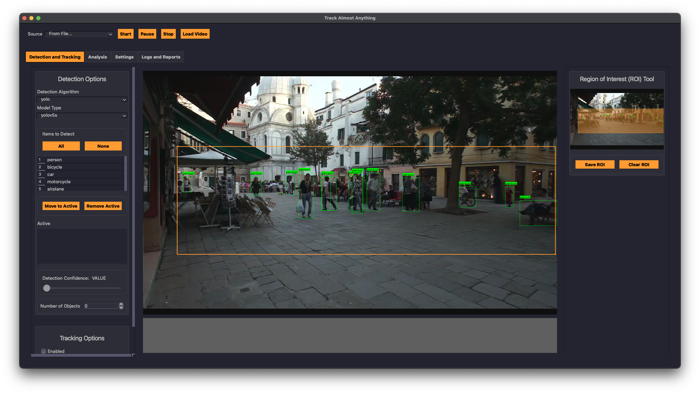

# Track Almost Anything

This Python-based software allows users to track various items or objects via a camera. This software will have various object detection algorithms (from Ultralysics' YOLO, Google's mediapipe, etc.) alongside tracking algorithms.

WARNING: Not functional yet.




## Installation

1. Install [poetry](https://python-poetry.org)

2. Clone the project

    ```zsh
    git clone https://github.com/Larsdb98/track-almost-anything.git
    ```

3. Install the poetry environment:

    ```zsh
    poetry install
    ```

4. Some packages will be missing because they can't be tracked properly with poetry. These have to be manually installed:

    ```zsh
    poetry run pip install ultralytics
    poetry run pip install torch
    ```

## Running The Tracker

To run the app, use the following command line:
```zsh
    poetry run tracker
```
To run the app with debug logging active, use the following command:
```zsh
    poetry run tracker --log-level DEBUG
```
For the complete list of arguments upon launch, run:
```zsh
    poetry run tracker -h
```

### Developing the UI

I'm using Qt Designer to create the UI files for this application. These UI files are then converted to a Python script using [pyside6-uic](https://doc.qt.io/qtforpython-6/tools/pyside-uic.html) conversion tool.

To open Qt Designer within the poetry environment:

```bash
poetry run pyside6-designer
```

